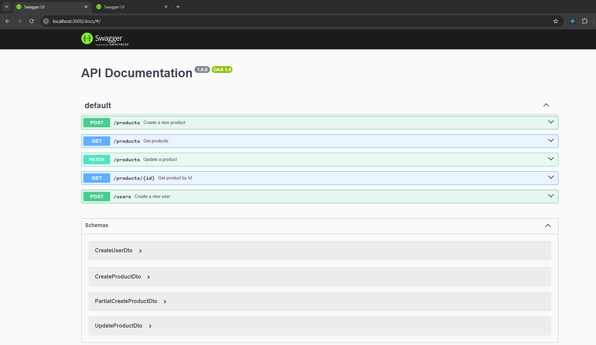

### Packages we used
1. ``swagger-jsdoc``
2. ``swagger-ui-express``
3. ``class-validator``
4. ``class-transformer``
5. ``class-validator-jsonschema``

### Types
2. ``@types/swagger-jsdoc``
2. ``@types/swagger-ui-express``

### Steps to run the repository locally
1. Install dependencies ``npm install``
2. Run locally ``npm run start:dev``
3. Go to ``http://localhost:3000/docs``
